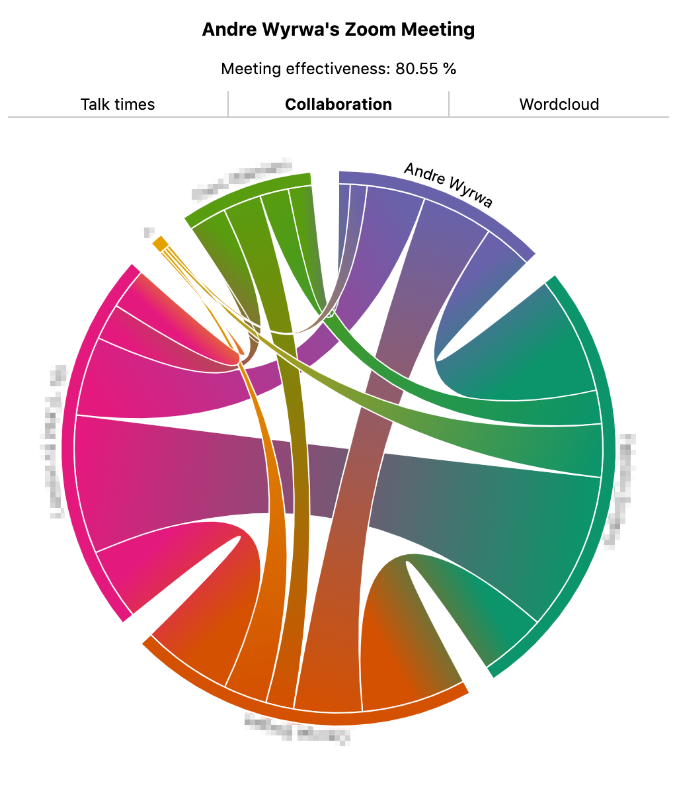

[](https://travis-ci.org/theiconic/zoomstats)
[](https://codeclimate.com/repos/5c54a7fc2deb395da200875d/maintainability)
[](https://codeclimate.com/repos/5c54a7fc2deb395da200875d/test_coverage)

# zoomstats

A command line utility and chrome extension to derive statistics from zoom recordings.



## Setup
Make sure you run
```bash
npm install
```
## Usage (command line)
You will need to feed it a saved VTT file of the
transcript of a recording. You can download this file from zoom's
recording overview page for the recording. You should see an
'Audio transcript' link on that page, allowing you to download the
file.
```bash
node src/index.js talktime <path/to/vtt/file.vtt>
```

You should get a small JSON dump with the (humanized) talk times per speaker,
like this:

```
analyzing file ../../../Downloads/Frontend-services catch-up - Zoom.htm
{ 'James T. Kirk': '15 minutes',
  'Hans Christian Anderssen': 'a few seconds',
  'James Norrington': 'a few seconds',
  'Old McDonald': '9 minutes',
  'Hank Williams': 'a few seconds',
  'Joshua Frasure': 'a few seconds',
  'Amanda Brown: 'a few seconds',
  'Peter Williams': 'a minute' }
```

## Available statistics
- **talktime** get the total talk times per speaker
- **effectiveness** get the percentage of actual talktime vs. total meeting time
- **topwords** get the twenty most used words from the meeting
- **collaboration** get an idea of who talked how much to who in the meeting

## Chrome extension
This also includes a chrome extension exposing the same functionality.
The extension is currently published privately.

## Contributing
Please feel free and encouraged to improve this project by
filing issues and pull requests.

A secondary aim of the project is to serve as a playground
for functional programming style in JS. PRs must adhere
to this, please.
